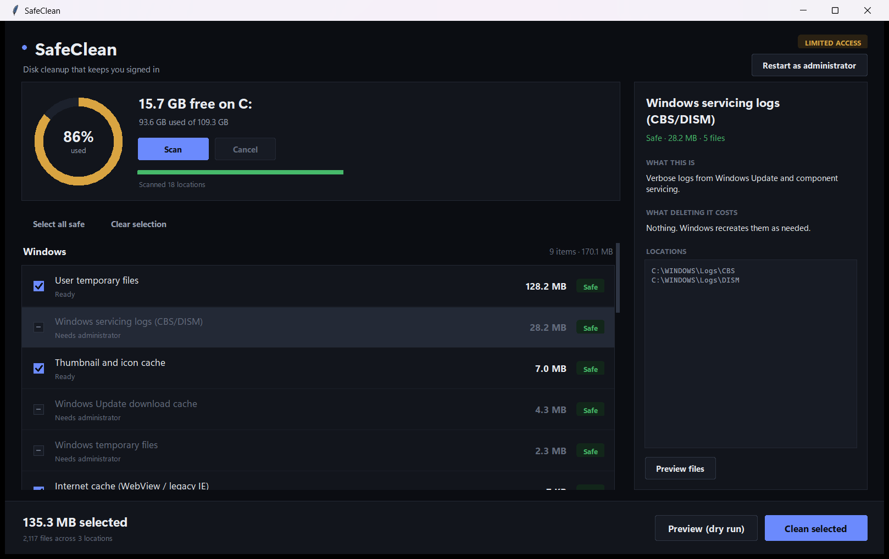
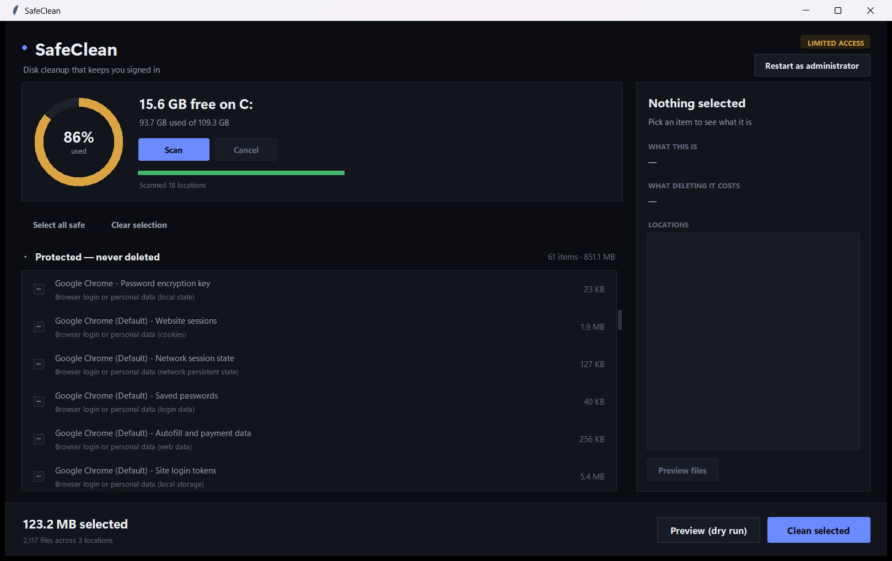

<div align="center">


# SafeClean

**A disk cleaner for Windows that will not log you out of anything.**

[](LICENSE)
[](https://python.org/downloads)
[](#requirements)
[](#running-the-tests)
[](#requirements)

</div>

---



## What this is

Most cleaners ask you to trust that they picked the right folders. SafeClean is
built the other way round: it **assumes a cleanup rule will eventually be
wrong**, so the rules never get the final say. Every deletion is checked
independently by a guard layer, and anything that could cost you a login is
refused there — including files the tool has never heard of.

In practice that means:

- It finds junk — Windows temp files, crash dumps, servicing logs, browser and
  developer caches — and tells you how big each pile is.
- It sorts everything by risk and **only pre-ticks the things with no downside.**
- It explains, in plain English, what each item is and what you lose by deleting
  it.
- It shows you everything before touching anything, and deletes nothing without
  a final confirmation.
- **It cannot delete your cookies, saved passwords, autofill data, bookmarks,
  history or extensions.** Not "does not" — *cannot*. That is enforced in code
  and covered by tests.

### What it will never touch

The window lists the things it is protecting, rather than hiding them, so you
can see the guard working instead of taking it on faith:



Every row here is locked. There is no setting that unlocks them.

---

## Requirements

| | |
|---|---|
| **OS** | Windows 10 or 11 |
| **Python** | 3.10 or newer, with the Tkinter that ships with it |
| **Packages** | None. Nothing to `pip install`. |

`Pillow` is needed only if you want to regenerate the app icon.

**Don't have Python?** Get it from
[python.org/downloads](https://python.org/downloads). During setup, tick
**"Add python.exe to PATH"** — the installer does not do this by default and
nothing will work without it.

---

## How to run it

### Step 1 — Download

Click the green **Code** button at the top of this page → **Download ZIP**, then
right-click the ZIP → **Extract All**.

Or, if you have Git:

```bash
git clone https://github.com/Kavishka-Deshan/SafeClean.git
```

### Step 2 — Start it

**The easy way:** open the folder and double-click **`run.bat`**.

**From a terminal:**

```bash
cd SafeClean
python main.py
```

That's it. No install step, no build step.

### Step 3 (optional) — Put it on your Desktop

```bash
python tools/install.py
```

This adds a **SafeClean** shortcut to your Desktop and Start menu, with the app
icon. To remove them later:

```bash
python tools/install.py --uninstall
```

---

## How to use it

**1. It scans automatically when it opens.** The ring shows how full your C:
drive is; the list below groups what it found into Windows, Developer and
Browser categories.

**2. Review what it found.** Click any row to see the details panel on the
right: what that item actually is, what deleting it costs you, and exactly which
folders are involved. **Preview files** lists the individual files.

**3. Tick what you want gone.** Only `SAFE` items are ticked for you. Everything
else you choose deliberately. **Select all safe** re-ticks the safe set;
**Clear selection** unticks everything.

**4. Try Preview (dry run) first.** It runs the complete pipeline — guard checks
included — and reports exactly what would be deleted, without deleting anything.

**5. Click Clean selected.** A confirmation dialog lists every category, its
size, and whether it is permanent or recoverable from the Recycle Bin. Nothing
is deleted until you confirm there.

### Two things you may see

**"Google Chrome is open — close it to clean this."** Cache files are locked
while a browser is running, and deleting them mid-run can corrupt the cache
index. Close the browser and press **Scan** again. SafeClean will never kill a
process for you.

**"Needs administrator."** Windows Temp, the servicing logs and the Update cache
live outside your user account. Click **Restart as administrator** in the top
right, accept the UAC prompt, and they become available.

---

## What it cleans

| Category | Included |
|---|---|
| **Windows** | User and system temp, crash dumps, error reports, CBS/DISM servicing logs, Windows Update download cache, Delivery Optimization, thumbnail and icon caches, Recycle Bin |
| **Developer** | npm, pip, Gradle, NuGet, Yarn, Maven, Cargo, Go build, VS Code caches |
| **Browsers** | Chrome, Edge, Brave, Vivaldi, Chromium, Firefox — across *every* profile, and only the allowlisted cache directories |

### Risk levels

| Level | Meaning | Pre-ticked? |
|:--|:--|:--|
| 🟢 `SAFE` | Regenerable junk, nothing lost | **Yes** |
| 🟡 `CAUTION` | Safe, but has a cost — a re-download, a slower first page load | **No** |
| 🔴 `REVIEW` | Your own files. You decide each one | **No** |
| ⬜ `PROTECTED` | Never deletable. Shown greyed out with the reason | **Cannot be** |

---

## How the protection actually works

`safeclean/guard.py` is consulted immediately before every file is removed, and
`cleaner._remove_one` is the **only** function in the codebase that deletes. Its
first statement is a guard check. There is no bypass flag and no code path
around it.

Four independent checks must all pass:

**1. Default deny under browser profiles.** Anything inside a browser's
user-data folder is refused unless it matches a short allowlist of cache
directory names — `Cache`, `Code Cache`, `GPUCache`,
`Service Worker/CacheStorage`, Firefox's `cache2`, and a few more. A browser
file the tool has never heard of is refused automatically, so a Chrome update
cannot silently widen what gets deleted.

**2. A credential blocklist**, matched at any depth regardless of rule:
`Cookies`, `Login Data`, `Web Data`, `Local State`, `Local Storage`,
`Session Storage`, `IndexedDB`, `Extensions`, `Bookmarks`, `History`,
`Preferences`, plus Firefox's `logins.json`, `key4.db`, `cookies.sqlite`,
`places.sqlite` and the rest.

> `Local State` is on that list for a specific reason: it holds the key that
> decrypts every saved password. Deleting it alone would lose all of them even
> though `Login Data` itself survives untouched. That is the kind of mistake
> this design exists to prevent.

**3. A system and personal-data denylist.** The Windows directory (except narrow
temp and log subtrees), Program Files, Documents, Desktop, Pictures, OneDrive,
`.ssh`, the DPAPI key stores, `pagefile.sys`, `WinSxS`, any `.git` directory,
and drive roots. These follow `%SystemDrive%`, so they stay correct when Windows
is installed somewhere other than C:.

**4. Traversal safety.** Symlinks and junctions are refused outright, and a path
must resolve to somewhere inside the root its rule declared.

The allowlist is *anchored*, so a directory called `Cache` buried inside
`Local Storage` does not inherit permission from it.

---

## Running the tests

```bash
python -m unittest discover -s tests -v
```

33 tests. The three that carry the most weight:

| Test | What it proves |
|---|---|
| `test_unknown_browser_file_is_denied_by_default` | A browser file not on the allowlist is refused — this is what keeps the tool safe against future browser releases |
| `test_overreaching_rule_cannot_touch_credentials` | Builds a fake browser profile, points a rule at the **entire profile directory**, runs the real cleaner, and asserts every credential file is still byte-identical. It simulates a buggy rule and proves the *guard*, not the rule, is what protects you |
| `test_denylist_follows_system_drive` | Protection tracks `%SystemDrive%`, so a Windows install on D: is covered too |

### Verifying against your own browsers

```bash
python verify_live.py --seed
```

This hashes every credential and session file in your real browser profiles,
seeds marker files into the cache directories, runs a **genuine** clean, then
re-hashes everything and reports anything that changed.

It only verifies browsers that are **closed**. A running browser rewrites its
own LevelDB logs and `Network Persistent State` every few seconds, which shows
up as a false failure — confirmed by a control run that fingerprinted a running
browser twice, six seconds apart, with no cleaning at all, and still saw
`Network Persistent State` change on its own.

---

## Project layout

```
main.py                  entry point, with platform checks
run.bat                  double-click launcher
verify_live.py           live proof against real browser profiles
safeclean/
  guard.py               the protection layer - everything routes through this
  rules.py               declarative cleaner definitions (data, no logic)
  scanner.py             read-only sizing + protected inventory
  cleaner.py             deletion engine; _remove_one is the only delete
  processes.py           running-process detection (never kills anything)
  elevation.py           admin detection and UAC relaunch
  report.py              JSON run log, written to %LOCALAPPDATA%\SafeClean\logs
  gui/theme.py           colour, type and spacing tokens; DPI scaling
  gui/widgets.py         canvas-drawn button, checkbox, pill, ring, scroll area
  gui/app.py             main window
  gui/confirm.py         final confirmation dialog
tests/
  test_guard.py          protection tests
  test_cleaner.py        sandbox deletion tests
tools/
  make_icon.py           generates the icon (needs Pillow)
  install.py             Desktop + Start menu shortcuts
SafeClean.spec           PyInstaller build (see the note below)
```

Every run writes a JSON log to `%LOCALAPPDATA%\SafeClean\logs` recording each
path, its size, and whether it was deleted, skipped or refused.

### Interface notes

The UI is drawn by hand on canvases, because ttk cannot do rounded corners,
hover states or a ring chart. The app also opts in to DPI awareness at import —
without it Windows renders a Tk window at 100% and bitmap-stretches it, which
makes text soft on a scaled display.

---

## Building a standalone .exe

`SafeClean.spec` produces `dist/SafeClean.exe` via PyInstaller:

```bash
pip install pyinstaller
python -m PyInstaller SafeClean.spec --noconfirm
```

**Be aware that Windows Smart App Control blocks it.** SAC refuses unsigned
binaries with no established reputation, with *"An Application Control policy
has blocked this file"* (CodeIntegrity event 3077). Self-signing does not help —
SAC wants a signature chaining to a CA it already trusts, which means a paid
code-signing certificate.

`tools/install.py` handles this automatically: it reads
`HKLM\SYSTEM\CurrentControlSet\Control\CI\Policy\VerifiedAndReputablePolicyState`
and, when SAC is enforcing, points the shortcuts at Python's own signed
`pythonw.exe` running `main.py` instead. Same app, same icon, no console window.
The `.exe` is used automatically on machines where SAC is off.

**Running from source is the recommended path, and the one with no warnings.**

---

## Things it deliberately will not do

- Kill a running process to clean its cache.
- Delete `WinSxS` by hand. Use
  `DISM /Online /Cleanup-Image /StartComponentCleanup` instead.
- Auto-select anything beyond `SAFE`.
- Delete personal files without routing them to the Recycle Bin.
- Touch anything that could sign you out of a website.

## Not built yet

- **Deep scan** for large files and old installers (the `REVIEW` tier). The risk
  level, Recycle Bin routing and UI category exist; the drive-walking scanner
  behind it does not.

---

## Contributing

Adding a cleaner means adding a `Rule` in `safeclean/rules.py`. You do not need
to touch the guard, and you should not: `rules.audit_rules()` runs at every scan
and aborts if a rule points somewhere the guard refuses.

Pull requests that weaken `guard.py` or remove protection tests will not be
accepted. If a genuine cache is being blocked, add its exact directory name to
`BROWSER_CACHE_ALLOWLIST` and include a test alongside it.

## Licence

MIT — see [LICENSE](LICENSE). Use it, fork it, ship it.
